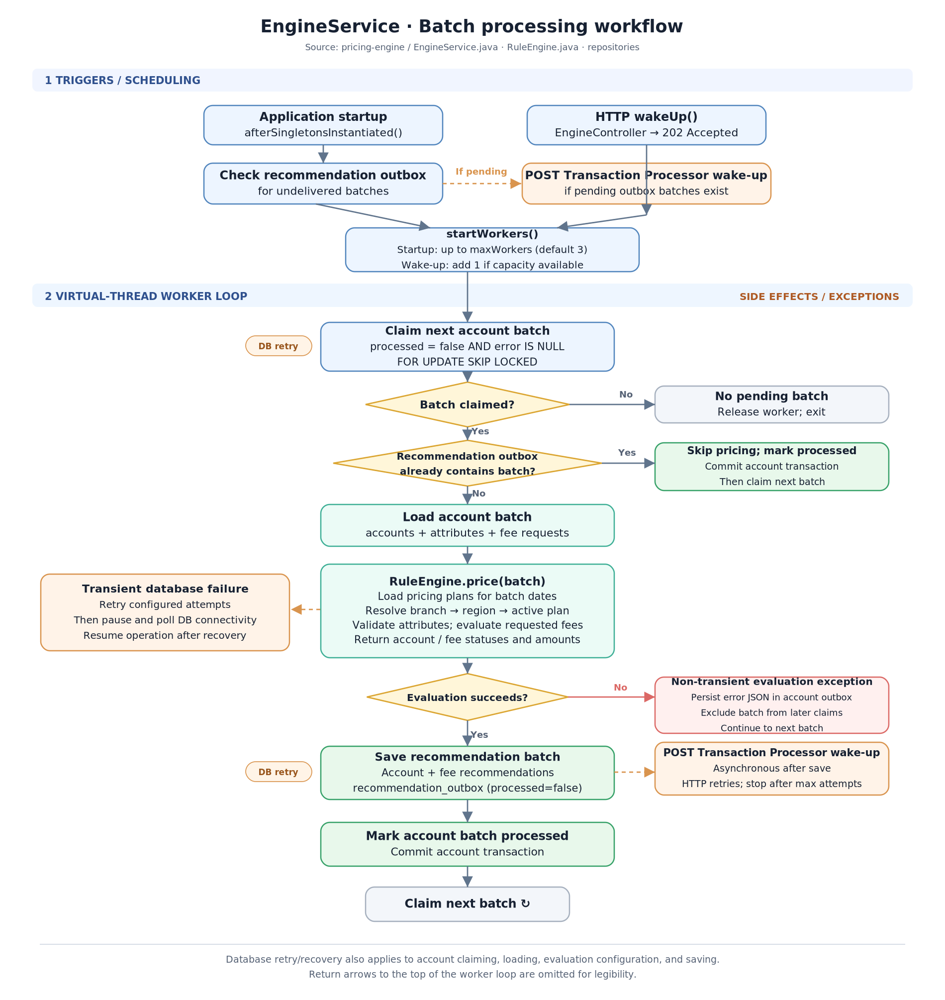
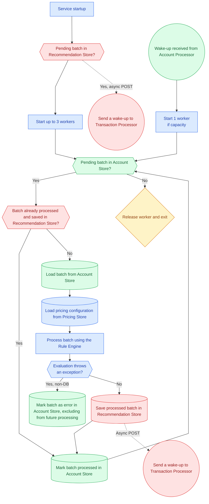
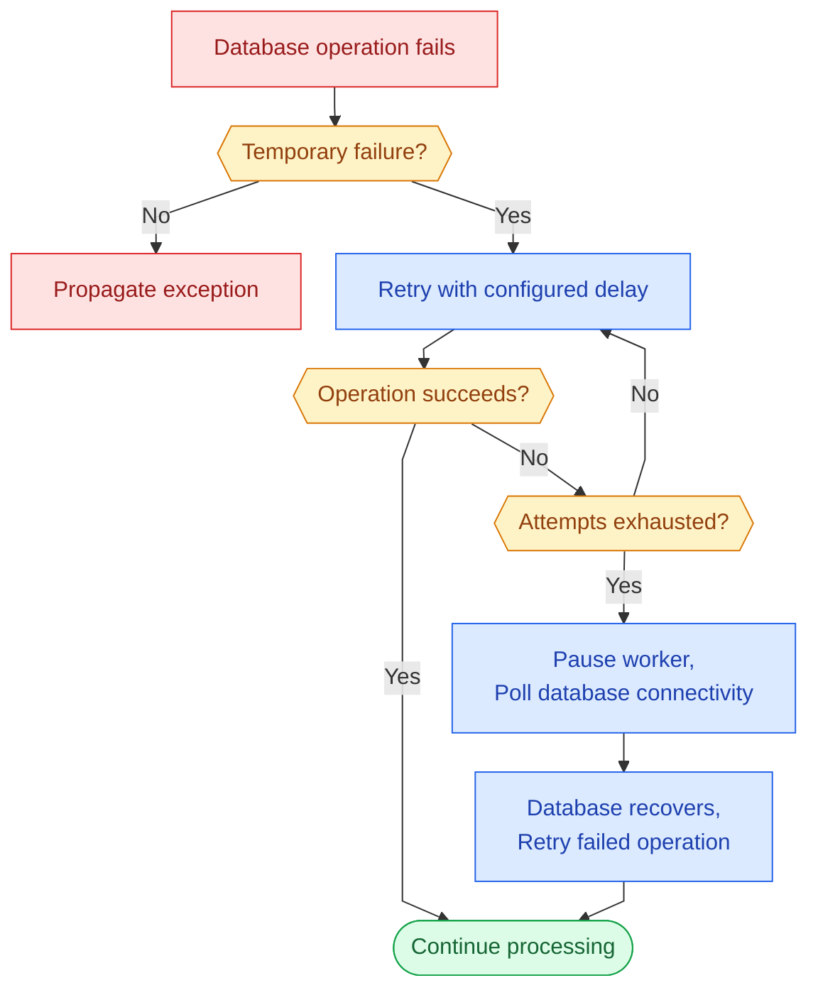

### Engine Service flow as image

### Engine Service flow as mermaid

```mermaid
%%{init: {"flowchart": {"curve": "linear", "nodeSpacing": 22, "rankSpacing": 28}}}%%
flowchart TD
    START["Service startup"]
    PENDING{{"Pending batch in Recommendation Store?"}}
    START --> PENDING

    PENDING --> WORKERS["Start up to 3 workers"]
    PENDING -.->|Yes, async POST| STARTPOST(("Send a wake-up to Transaction Processor"))

    HTTP(("Wake-up received from Account Processor")) --> ADD["Start 1 worker<br/>if capacity"]
    ADD --> CLAIM
    WORKERS --> CLAIM
    MARK --> CLAIM

    CLAIM{{"Pending batch in Account Store?"}}
    CLAIM -->|Yes| EXISTS{{"Batch already processed and saved in Recommendation Store?"}}
    CLAIM -->|No| IDLE{"Release worker and exit"}

    EXISTS -->|Yes| MARK
    EXISTS -->|No| LOAD[("Load batch from Account Store")]

    LOAD --> LOAD_CONFIG[("Load pricing configuration from Pricing Store")]
    LOAD_CONFIG --> PRICE["Process batch using the Rule Engine"]

    PRICE --> ERROR{{"Evaluation throws<br/>an exception?"}}
    ERROR -->|Yes, non-DB| RECORD[("Mark batch as error in Account Store, excluding from future processing")]
    ERROR -->|No| SAVE[("Save processed batch in Recommendation Store")]

    SAVE --> MARK[("Mark batch processed in Account Store")]
    SAVE -.->|Async POST| NOTIFY(("Send a wake-up to Transaction Processor"))

    classDef service fill:#dbeafe,stroke:#2563eb,color:#1e40af
    classDef upstream fill:#dcfce7,stroke:#16a34a,color:#166534
    classDef downstream fill:#fee2e2,stroke:#dc2626,color:#991b1b
    classDef exit fill:#fef3c7,stroke:#d97706,color:#92400e
    classDef success fill:#dcfce7,stroke:#16a34a,color:#166534

    class START,WORKERS,ADD,ERROR,LOAD_CONFIG,PRICE service
    class HTTP,CLAIM,LOAD,RECORD,MARK upstream
    class PENDING,STARTPOST,EXISTS,SAVE,NOTIFY downstream
    class IDLE exit
```

### DB failure handling

```mermaid
%%{init: {"flowchart": {"curve": "linear", "nodeSpacing": 25, "rankSpacing": 28}}}%%
flowchart TD
    FAIL["Database operation fails"]
    TEMP{{"Temporary failure?"}}
    FAIL --> TEMP

    TEMP -->|No| PROP["Propagate exception"]
    TEMP -->|Yes| RETRY["Retry with configured delay"]
    RETRY --> MAX{{"Operation succeeds?"}}

    MAX -->|Yes| CONT(["Continue processing"])
    MAX -->|No| EXHAUSTED{{"Attempts exhausted?"}}
    EXHAUSTED -->|No| RETRY
    EXHAUSTED -->|Yes| PAUSE["Pause worker,<br/>Poll database connectivity"]

    PAUSE --> RECOVER["Database recovers,<br/>Retry failed operation"]
    RECOVER --> CONT

    classDef decision fill:#fef3c7,stroke:#d97706,color:#92400e
    classDef error fill:#fee2e2,stroke:#dc2626,color:#991b1b
    classDef success fill:#dcfce7,stroke:#16a34a,color:#166534
    classDef process fill:#dbeafe,stroke:#2563eb,color:#1e40af

    class TEMP,MAX,EXHAUSTED decision
    class FAIL,PROP error
    class CONT success
    class RETRY,PAUSE,RECOVER process

```
