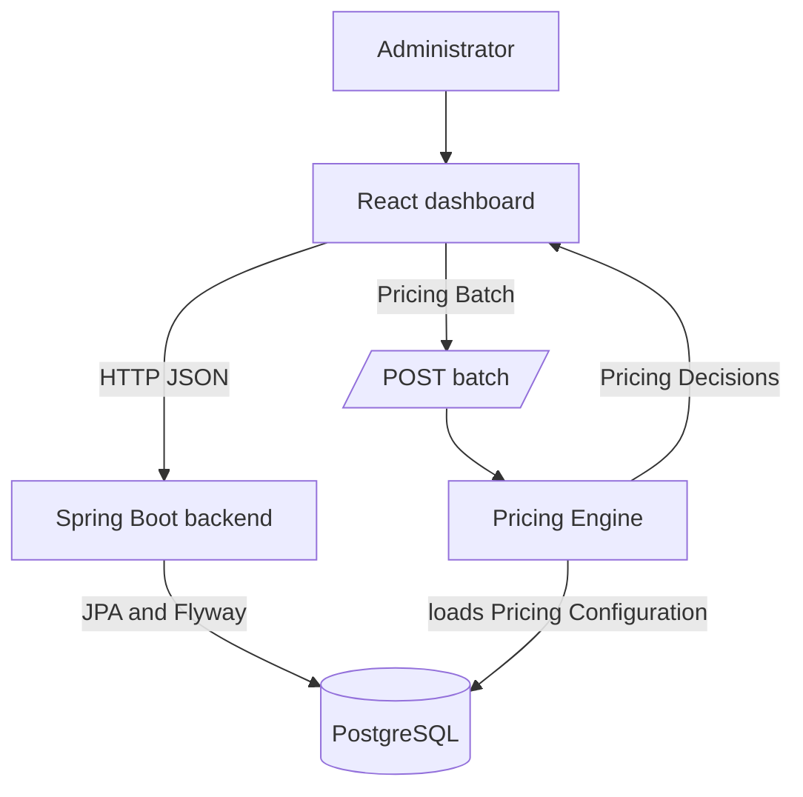

---
aliases:
  - Pricing Project Wiki
  - Project Knowledge Home
status: current
verified: 2026-08-29
tags:
  - agent-wiki
  - home
---

# Project Knowledge Home

This vault explains the implemented Pricing application for agents making features and changes. It connects the domain language to the code paths that enforce it.

> [!important] Sources of truth
> This wiki is a navigation and explanation layer. When it conflicts with an authoritative source, follow the authoritative source: the repository [CONTEXT.md](../../../../CONTEXT.md) for vocabulary, [ADRs](../../../ADR/) for accepted decisions, [openapi.yaml](../../../../pricing-backend/openapi.yaml) for the HTTP contract, migrations and code for implementation, and [Validations.md](../../../Validations.md) for the validation matrix.

## Start with the task

| Task | Read first |
|---|---|
| Learn the business vocabulary | [[01 Domain/CONTEXT]] and [[01 Domain/Concept Relationships]] |
| Understand the running system | [[02 Architecture/System Overview]] |
| Change backend behavior | [[02 Architecture/Backend]] and [[04 Change Guides/Implement a Feature or Change]] |
| Change a dashboard screen | [[02 Architecture/Dashboard]] and [[04 Change Guides/Implement a Feature or Change]] |
| Change an endpoint or payload | [[02 Architecture/API Contract]] |
| Change Pricing Plan configuration | [[03 Workflows/Configure Pricing]] |
| Change Pricing Batch evaluation | [[03 Workflows/Evaluate a Pricing Batch]] |
| Add or move validation | [[05 Reference/Validation and Integrity]] |
| Work on future distributed processing | [[05 Reference/Current and Planned System]] |

## Fast mental model

The application has two repositories and one current runtime boundary:

The dashboard configures Branches, Regions, Products, Fees, Account Attributes, Eligibility Reasons, and Pricing Plans. Its simulator builds a [[01 Domain/CONTEXT#Pricing Batch|Pricing Batch]] and sends it synchronously to the backend. The backend loads an immutable configuration view, resolves each account's Region and Pricing Plan, then returns one [[01 Domain/CONTEXT#Pricing Decision|Pricing Decision]] for each valid [[01 Domain/CONTEXT#Fee Request|Fee Request]].

The repository also contains accepted and in-progress designs for persisted asynchronous batch processing. Those designs are not the current request path. See [[05 Reference/Current and Planned System]].

## Repository map

| Location | Responsibility |
|---|---|
| `pricing-backend/` | Spring Boot API, Pricing Engine, JPA persistence, Flyway migrations, OpenAPI contract, backend tests |
| `pricing-dashboard/` | React Router SPA, screens and forms, generated TypeScript client, Playwright tests |
| `docs/ADR/` | Accepted architectural and domain decisions |
| `docs/Validations.md` | Cross-layer validation ownership and expected errors |
| `docs/planned-system-architecture.md` | Design-in-progress for later distributed processing |
| `.scratch/` | Local feature specs and implementation tickets; conventions are in [issue-tracker.md](../../issue-tracker.md) |

## Reading rule

Use canonical domain terms even when class or field names are shorter. In particular, distinguish a reusable **Fee** definition from a **Pricing Plan Fee**, which is the Fee as configured on one Pricing Plan with its Fee Amount and Eligibility Reasons.

