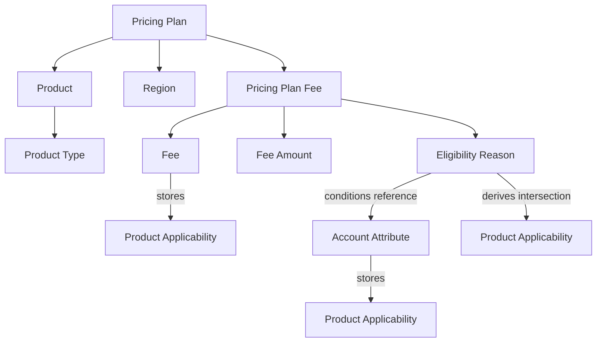
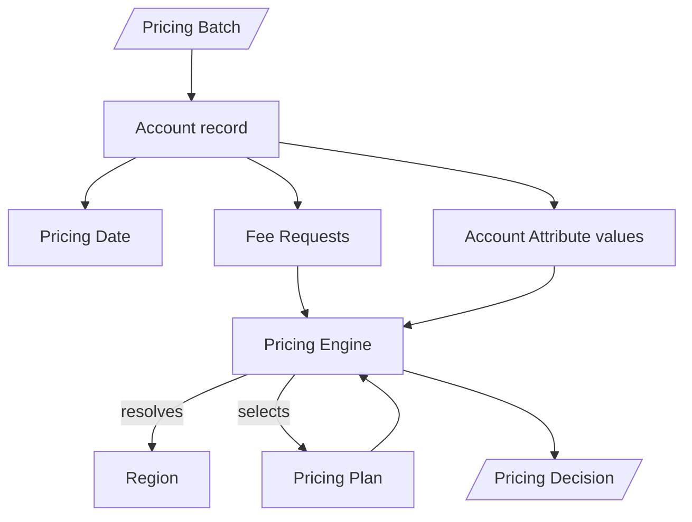

# Concept relationships

## Configuration graph



The reusable definition and configured use are separate:

- A **Fee** defines identity, calculation type, and Product Applicability.
- A **Pricing Plan Fee** selects that Fee for one Pricing Plan, gives it a Fee Amount, and attaches Eligibility Reasons.
- An **Eligibility Reason** belongs to no Fee by itself. It is reusable and is attached through a Pricing Plan Fee.
- An **Account Attribute** definition gives a condition its name, type, and Product Applicability. The condition stores the operator and comparison value.

## Product Applicability

Fees and Account Attributes store their applicable Product Types. Eligibility Reasons calculate theirs:

```text
Eligibility Reason Product Applicability
  = intersection of Product Applicability for every condition Account Attribute
```

An Eligibility Reason with no conditions applies to every Product Type. An intersection with no shared Product Type is invalid. This rule is recorded by [ADR 0003](../../../ADR/0003-use-product-type-applicability-for-shared-configuration.md) and implemented in [EligibilityReasonEntity.java](../../../../pricing-backend/src/main/java/com/pricing/backend/eligibilityreason/EligibilityReasonEntity.java) and [EligibilityReasonValidator.java](../../../../pricing-backend/src/main/java/com/pricing/backend/eligibilityreason/EligibilityReasonValidator.java).

## Geographic resolution

A Region can claim individual Branches, ZIP codes, and states. During evaluation, the Pricing Engine uses the first tier that has any match:

```text
exact Branch membership
  then ZIP code membership
  then state membership
```

If the winning tier has no match, the account has `REGION_NOT_FOUND`. If it has multiple matches, the account has `ERROR`. Database uniqueness constraints normally prevent ambiguity within each tier. See [[03 Workflows/Evaluate a Pricing Batch#2. Resolve the Region]].

## Effective time

A Pricing Plan is selected by exact Product, resolved Region, and inclusive Pricing Date:

```text
activeFrom <= Pricing Date <= activeThrough
```

For a given Product and Region, active periods cannot overlap. The Pricing Plan lifecycle uses the separate application current date:

| Stage | Date relationship | Allowed changes |
|---|---|---|
| Scheduled | current date is before `activeFrom` | Full update and deletion |
| Active | current date is within the inclusive period | Plan Name and Active Through only; no deletion |
| Past | current date is after `activeThrough` | Plan Name only; deletion allowed |

The lifecycle is defined by [ADR 0001](../../../ADR/0001-use-a-date-based-pricing-plan-lifecycle.md).

## Evaluation graph



The Pricing Engine validates only the Account Attributes required by the requested Pricing Plan Fees. Each Fee Request is correlated independently by its Fee Request ID, even when several requests use the same Fee code.

