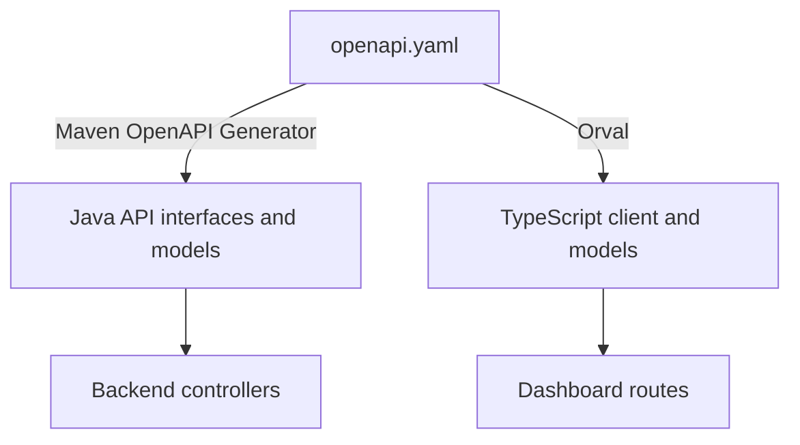

# API contract

[pricing-backend/openapi.yaml](../../../../pricing-backend/openapi.yaml) is the single HTTP contract shared by both repositories.

## Backend generation

The Maven build generates Spring interfaces in `com.pricing.backend.generated.api` and models in `com.pricing.backend.generated.model`. Handwritten controllers implement the interfaces. Contract constraints become Jakarta validation on generated request models.

## Dashboard generation

Orval reads the same file and generates fetch functions plus model files under `app/generated/api/`. The custom mutator preserves status, body, and headers rather than throwing for non-2xx responses.

## Contract change surface

An endpoint or schema change normally affects all of these:

1. `pricing-backend/openapi.yaml`;
2. generated Java interfaces/models and handwritten controller/service/mapper use sites;
3. backend contract and API tests;
4. regenerated dashboard client/models;
5. dashboard route loaders/actions and form/result rendering;
6. Playwright request fixtures and response expectations;
7. `docs/Validations.md` when validation ownership or error behavior changes.

Generated code is evidence of the contract, not the editing surface. Change the contract and regenerate it.

## Response conventions

- Create returns `201`; successful reads and updates return `200`; deletion returns `204`.
- Contract and business-rule validation normally return `400`.
- Missing resources return `404`.
- uniqueness, reference, and record-in-use conflicts return `409`.
- a Pricing Configuration access failure during batch evaluation returns `503`.
- error bodies use `ErrorResponse.message`.

The shared dashboard CRUD action checks the expected success status for each operation. A backend status change therefore requires an intentional dashboard change even when the JSON body is unchanged.

## Batch correlation contract

The Pricing Batch contract uses three correlation levels:

- `batchId` identifies the Pricing Batch and is echoed by the result;
- `accountNumber` identifies an account within that batch and must be unique there;
- `feeRequestId` identifies a Fee Request within one account and must be unique there.

The same Fee Request ID may appear in different accounts, and one account may repeat the same Fee code under different Fee Request IDs. Consumers correlate by identifiers, not array order.

## Scalar Account Attribute values

The contract permits Account Attribute values that are strings, numbers, or booleans. Backend Jackson configuration maps that generated union-like interface through a custom deserializer. The Pricing Engine later compares the runtime value to the configured Account Attribute type and returns an account status for a mismatch.

Related implementation:

- [JacksonConfig.java](../../../../pricing-backend/src/main/java/com/pricing/backend/config/JacksonConfig.java)
- [BatchMapper.java](../../../../pricing-backend/src/main/java/com/pricing/backend/batch/BatchMapper.java)
- [BatchRequestContractApiTests.java](../../../../pricing-backend/src/test/java/com/pricing/backend/batch/BatchRequestContractApiTests.java)

