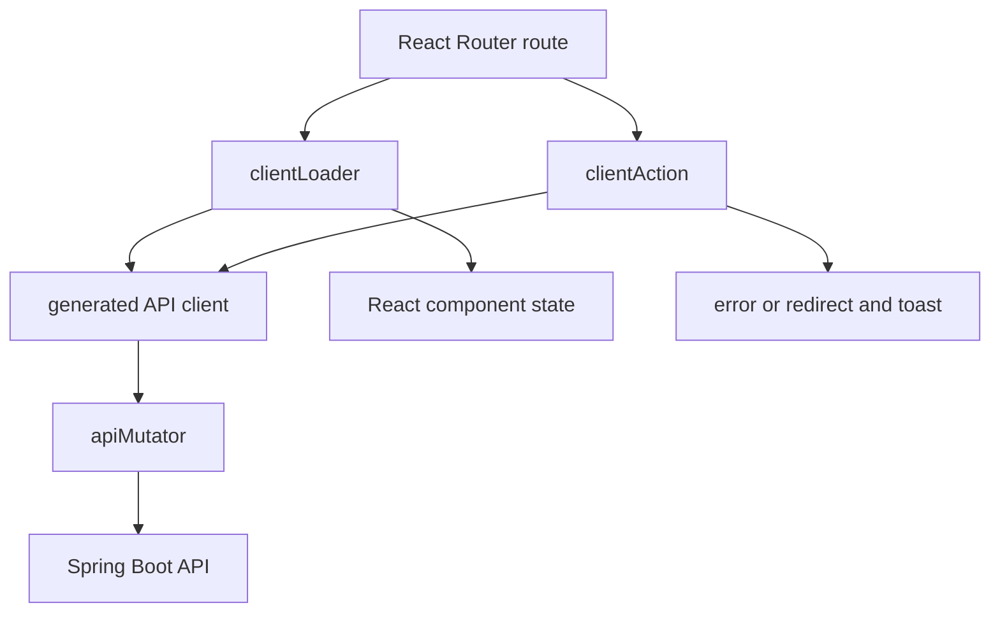

# Dashboard architecture

The dashboard is a React 19 client-side SPA built with React Router 7, TypeScript, Vite, AG Grid, React Select, and React Datepicker. Server-side rendering is disabled in [react-router.config.ts](../../../../pricing-dashboard/react-router.config.ts).

## Routes and screens

[routes.ts](../../../../pricing-dashboard/app/routes.ts) defines one shared layout and these screens:

- Branches, Regions, Products, Fees;
- Account Attributes and Eligibility Reasons;
- Pricing Plans, also used as the index route;
- Batch Simulator.

Each configuration type has a list route and a `:operation/:id?` CRUD route. The shared operations are create, view, update, and delete. List screens use `ListPage`; forms use `CrudPageTopMenu` and feature-specific fields.

## Data flow

[crudRouteUtils.ts](../../../../pricing-dashboard/app/utils/crudRouteUtils.ts) centralizes standard CRUD parameter validation, parallel record/options loading, action dispatch, response-code checks, success redirects, and error extraction. Pages keep editable values in local state through [useFormValues.ts](../../../../pricing-dashboard/app/hooks/useFormValues.ts).

The generated client returns `{ data, status, headers }` for both successful and unsuccessful HTTP responses. [apiMutator.ts](../../../../pricing-dashboard/app/utils/apiMutator.ts) also turns a network failure into a synthetic `503` response, so loaders and actions handle backend and network failures in the same shape.

## Generated client boundary

[orval.config.ts](../../../../pricing-dashboard/orval.config.ts) generates `app/generated/api/client.ts` and `app/generated/api/models/` from the backend's `openapi.yaml`. Application code imports these functions and types. Treat `app/generated/api/` as derived output.

## Form conventions

The dashboard combines several kinds of prevention:

- native input constraints for required values, lengths, patterns, minimums, and types;
- disabled controls when a record or relationship cannot currently be changed;
- option filtering by Product Applicability;
- editable list controls that prevent a second incomplete child row;
- backend error display when the API remains authoritative.

The form state is intentionally feature-local rather than stored in a global state library.

## Pricing Plan special case

[pricingPlans/crud.tsx](../../../../pricing-dashboard/app/routes/pricingPlans/crud.tsx) first loads primary options. Once Product and Region both exist, it fetches [[01 Domain/CONTEXT#Secondary Pricing Plan Options|Secondary Pricing Plan Options]]. The response is accepted only if its echoed Product and Region IDs still match the current selection, preventing a slow earlier request from overwriting newer context.

Secondary options drive:

- Product-applicable Fees and Eligibility Reasons;
- unavailable active periods for the Product and Region;
- the application current date;
- whether the active-period and Pricing Plan Fee controls are enabled.

The page mirrors lifecycle mutability in its disabled fields, while the backend remains authoritative. [PricingPlanFeeEditor.tsx](../../../../pricing-dashboard/app/routes/pricingPlans/PricingPlanFeeEditor.tsx) prevents duplicate Fees and prevents adding another row while an [[01 Domain/CONTEXT#Incomplete Pricing Plan Fee|Incomplete Pricing Plan Fee]] exists.

## Simulator special case

[simulator/index.tsx](../../../../pricing-dashboard/app/routes/simulator/index.tsx) maintains account and Fee Request drafts in local state. Product selection filters Account Attributes and Fees by Product Applicability. Every account and Fee Request receives a stable client-side correlation identifier. `Send` creates a new batch UUID and posts the whole Pricing Batch through a React Router fetcher without navigation.

While a request is pending or results are shown, the submitted draft is read-only. Results are correlated by Account Number and Fee Request ID rather than response order. `Reset` clears results while preserving the draft; an HTTP or network failure restores editability.

## Browser tests

Playwright tests under [e2e](../../../../pricing-dashboard/e2e/) intercept backend requests. They verify form behavior, Product Applicability, Pricing Batch composition, correlation under reordered results, and error recovery without requiring the backend. Add coverage to the feature spec that owns the changed behavior.

