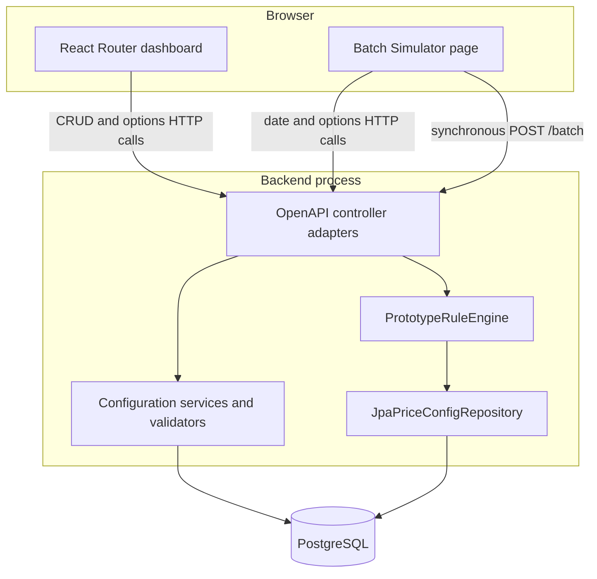

# System overview

## Implemented runtime

The current application is a browser SPA, one Spring Boot process, and PostgreSQL.



The backend owns Pricing Configuration writes. Flyway creates and evolves the schema; Hibernate validates the mappings rather than creating tables. The dashboard consumes the backend's OpenAPI contract through generated TypeScript code.

## Two major capabilities

### Pricing Configuration

CRUD endpoints manage:

- Branches and Regions for geographic resolution;
- Products and their Product Types;
- reusable Fees and Account Attributes with Product Applicability;
- Eligibility Reasons composed of typed Account Attribute conditions;
- Pricing Plans and their Pricing Plan Fees.

The standard request flow is:

```text
dashboard route loader/action
  -> generated TypeScript client
  -> generated Java API interface implemented by a controller
  -> service and validator
  -> mapper and Spring Data repository
  -> PostgreSQL
```

### Pricing evaluation

The simulator builds a Pricing Batch in browser state and sends `POST /batch`. `BatchController` validates batch-wide invariants, maps the generated contract model into engine-owned records, invokes the Pricing Engine, and maps results back to the contract.

The current call is synchronous. The Pricing Batch and Pricing Decisions are not persisted by this path. See [[03 Workflows/Evaluate a Pricing Batch]].

## The two dates

| Date | Owner | Purpose |
|---|---|---|
| Application current date | `SimulatorService` in-memory application clock | Controls Pricing Plan lifecycle mutability and the dates disabled in Pricing Plan forms |
| Pricing Date | Each account in a Pricing Batch | Selects the Pricing Plan used to evaluate that account |

The simulator normally copies its application date into every drafted account's Pricing Date when it submits a batch. The Pricing Engine itself evaluates the submitted Pricing Date and does not read the simulator clock.

## Configuration snapshot boundary

For one Pricing Engine invocation, [JpaPriceConfigRepository.java](../../../../pricing-backend/src/main/java/com/pricing/backend/batch/JpaPriceConfigRepository.java) loads one immutable `PriceConfig`:

- every Branch and Region membership;
- only Pricing Plans active on at least one distinct submitted Pricing Date;
- the selected plans' Fees, Eligibility Reasons, conditions, and Account Attribute definitions.

The phased reads run in a read-only `REPEATABLE_READ` transaction. Evaluation begins after the snapshot is mapped into engine-owned immutable records. This boundary implements [ADR 0004](../../../ADR/0004-choose-pricing-engine-evaluation-location.md).

## What is outside the current runtime

The planned Account Processor, persisted account batches, separate Pricing Engine service, recommendation store, transactional outbox, HTTP wake-up notifications, and Transaction Processor do not exist in the current source path. Treat [[05 Reference/Current and Planned System]] as the boundary between implemented and planned behavior.

## Primary implementation entry points

- Backend boot: [BackendApplication.java](../../../../pricing-backend/src/main/java/com/pricing/backend/BackendApplication.java)
- Contract: [openapi.yaml](../../../../pricing-backend/openapi.yaml)
- Batch adapter: [BatchController.java](../../../../pricing-backend/src/main/java/com/pricing/backend/batch/BatchController.java)
- Pricing Engine: [PrototypeRuleEngine.java](../../../../pricing-backend/src/main/java/com/pricing/engine/PrototypeRuleEngine.java)
- Dashboard routes: [routes.ts](../../../../pricing-dashboard/app/routes.ts)
- Simulator screen: [simulator/index.tsx](../../../../pricing-dashboard/app/routes/simulator/index.tsx)

