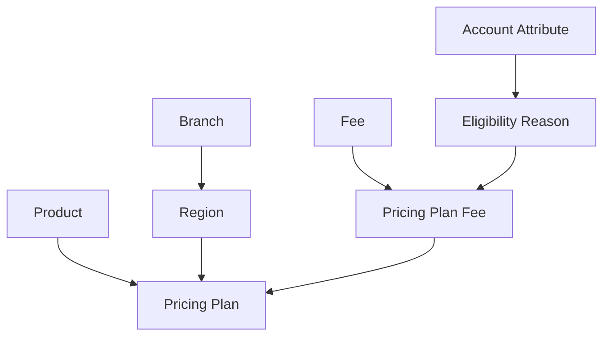

# Configure pricing

Pricing Configuration is assembled from reusable records into an effective Pricing Plan.

## Dependency order

A practical creation order is:

1. Create Branches, then create Regions that select Branches, ZIP codes, and states.
2. Create Products and assign Product Types.
3. Create reusable Fees with flat-or-percentage type and Product Applicability.
4. Create typed Account Attributes with Product Applicability.
5. Create Eligibility Reasons whose conditions reference Account Attributes.
6. Create a Pricing Plan for a Product and Region, then add Pricing Plan Fees with Fee Amounts and optional Eligibility Reasons.

## Region configuration

A Branch, ZIP code, or state can belong to at most one Region at its own tier. The Region form excludes values already claimed by another Region. The database uniqueness constraints are authoritative.

The three Region membership types are not interchangeable. Evaluation prefers exact Branch membership, then ZIP code, then state.

## Reusable pricing configuration

### Fee

A Fee has no amount. It defines code, name, calculation type, and Product Applicability. The Fee Amount is supplied only when the Fee is attached to a Pricing Plan.

### Account Attribute

An Account Attribute defines a code, name, type, and Product Applicability. Supported types are text, decimal, integer, date, and boolean. The type controls both condition-value normalization during configuration and runtime comparison during evaluation.

### Eligibility Reason

Every condition references an Account Attribute, operator, and value. Values are normalized to a persisted string representation according to the Account Attribute type. Duplicate conditions are allowed; the condition table has its own identity.

Every condition must be satisfied for the Eligibility Reason to be satisfied. Product Applicability is derived from the intersection of the condition Account Attributes. A conditionless Eligibility Reason is unconditional and applies to all Product Types.

## Pricing Plan form flow

1. Primary options load Products, Regions, and the application current date.
2. Product and Region selection triggers [[01 Domain/CONTEXT#Secondary Pricing Plan Options|Secondary Pricing Plan Options]].
3. Until those options arrive, active-period and Pricing Plan Fee inputs remain unavailable.
4. Unavailable intervals prevent active-period overlap for that Product and Region.
5. The Fee picker contains only Fees supporting the Product Type.
6. The Eligibility Reason picker contains only Reasons whose derived Product Applicability supports the Product Type.
7. A selected Fee receives a non-negative Fee Amount and zero or more Eligibility Reasons.
8. One Pricing Plan cannot use the same Fee twice, and one Pricing Plan Fee cannot attach the same Eligibility Reason twice.

Secondary responses echo Product and Region IDs. The dashboard rejects a response that no longer matches the current selection; the backend independently revalidates all submitted references and applicability.

## Lifecycle and historical integrity

The application current date classifies each Pricing Plan:

- **Scheduled:** all fields and Pricing Plan Fees may change; deletion is allowed.
- **Active:** only Plan Name and Active Through may change; deletion is rejected.
- **Past:** only Plan Name may change; deletion is allowed.

The lock extends through shared configuration as recorded in [ADR 0002](../../../ADR/0002-restrict-updates-to-shared-pricing-configuration.md):

- a Fee definition cannot change after any Pricing Plan contains it, but its name can;
- an Eligibility Reason's code or conditions cannot change after any Pricing Plan Fee uses it, but its name can;
- an Account Attribute's code, type, or Product Applicability cannot change after an Eligibility Reason uses it, but its name can.

Membership reordering is not a definition change. When protected configuration must change, create a replacement record and use it from the scheduled Pricing Plan.

## Deletion integrity

Referenced Branches, Products, Regions, Fees, Account Attributes, and Eligibility Reasons cannot be deleted. Services locate a referencing record to produce a descriptive `409`, and foreign keys remain the final integrity boundary.

The detailed ownership and expected error text live in [Validations.md](../../../Validations.md).

