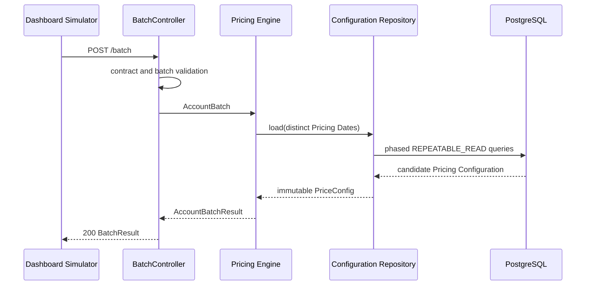

# Evaluate a Pricing Batch

The current Pricing Batch path is synchronous:



## 1. Validate and map the Pricing Batch

The generated contract validates required fields, collection sizes, scalar shapes, and basic numeric constraints. `BatchValidator` adds collection and correlation rules:

- Account Numbers are unique within the Pricing Batch;
- Fee Request IDs are unique within one account;
- accounts, Account Attributes, and Fee Requests contain no null elements;
- a supplied transaction amount uses increments of `0.01`.

Repeated Fee codes are valid. The mapper converts generated HTTP models to engine-owned records.

## 2. Load one configuration snapshot

The Pricing Engine collects distinct Pricing Dates and asks `PriceConfigRepository` for one configuration. The JPA adapter loads all Branches and Regions but only Pricing Plans active on at least one submitted Pricing Date, plus their complete Fee and Eligibility Reason graph.

If configuration access fails, the request returns `503`; it is not converted into per-account statuses.

## 3. Resolve each account

Accounts are evaluated independently against the same immutable configuration.

### Resolve the Branch

Branch code lookup is exact. A miss returns `BRANCH_NOT_FOUND` for that account.

### Resolve the Region

The engine checks Region tiers in priority order:

1. exact Branch membership;
2. ZIP code membership;
3. state membership.

It stops at the first tier containing a match. No match returns `REGION_NOT_FOUND`; multiple matches in the winning tier return `ERROR`.

### Select the Pricing Plan

A match requires exact Product code, exact resolved Region code, and an inclusive active period:

```text
activeFrom <= Pricing Date <= activeThrough
```

No match returns `PLAN_NOT_FOUND`; multiple matches return `ERROR`.

### Validate required Account Attributes

The engine derives requirements only from Eligibility Reason conditions attached to requested Pricing Plan Fees. An Account Attribute used only by an unrequested Fee is not required.

For required codes:

- a repeated value returns `DUPLICATE_ATTRIBUTE`;
- a value whose runtime representation does not match its configured type returns `INVALID_ATTRIBUTE_TYPE`;
- an absent value returns `MISSING_ATTRIBUTE`.

An account-level failure omits its Pricing Plan code and Fee results. Other accounts continue.

## 4. Evaluate each Fee Request

For each Fee Request:

1. Find the Pricing Plan Fee by exact Fee code. A miss returns `FEE_NOT_FOUND`.
2. For a percentage Fee, require a transaction amount. Absence returns `MISSING_TRANSACTION`; at the engine boundary, a negative value or more than two decimal places returns `INVALID_TRANSACTION_AMOUNT`.
3. Validate persisted Eligibility Reason operator/type combinations and values. Invalid configuration returns `INVALID_ELIGIBILITY_CONDITION` for that Fee Request.
4. Evaluate every attached Eligibility Reason. Conditions inside one reason use AND; reasons attached to the Pricing Plan Fee use OR.
5. If any reason is satisfied, return a **waived** Pricing Decision with every satisfied Eligibility Reason code.
6. Otherwise return a **charged** Pricing Decision.

Fee failures are isolated to that Fee Request. Other Fee Requests and accounts continue.

The current HTTP adapter rejects a supplied transaction amount that is not an increment of `0.01` before evaluation, so an HTTP caller normally receives `400` for excess decimal precision. The engine's `INVALID_TRANSACTION_AMOUNT` status remains defense at the engine boundary and is relevant to direct or future persisted-batch callers.

## 5. Calculate the charged amount

| Fee type | Calculation |
|---|---|
| Flat | Fee Amount |
| Percentage | `transactionAmount * Fee Amount / 100` |

The charged amount is rounded to two decimal places with `HALF_UP`. A conditionless Eligibility Reason is satisfied, so attaching one makes the Pricing Plan Fee unconditionally waived after transaction validation.

## 6. Correlate the result

The response echoes `batchId`. Accounts are correlated by Account Number; Fee results are correlated by Fee Request ID. Result order is not a contract.

Successful Fee Requests have status `OK` and exactly one Pricing Decision shape:

- `CHARGED` with `amount` and no Eligibility Reasons;
- `WAIVED` with satisfied Eligibility Reason codes and no amount.

The enum definitions are in [AccountBatchResult.java](../../../../pricing-backend/src/main/java/com/pricing/engine/AccountBatchResult.java), and executable examples are in [PrototypeRuleEngineTests.java](../../../../pricing-backend/src/test/java/com/pricing/engine/PrototypeRuleEngineTests.java) and [BatchApiTests.java](../../../../pricing-backend/src/test/java/com/pricing/backend/batch/BatchApiTests.java).
