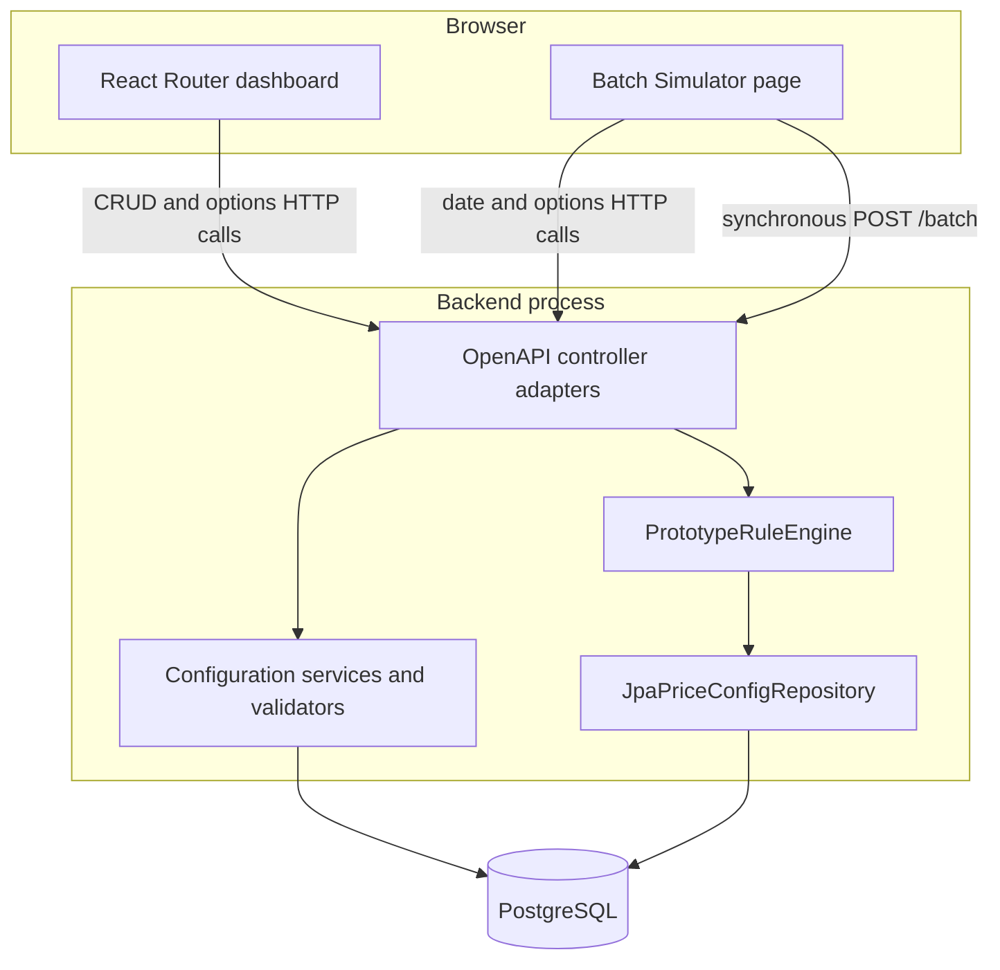

# Current Implementation

Status: current implementation snapshot  
Verified against source: 2026-08-30

Backend snapshot: `with-engine` at `d9bdcee89ba443aa8caa64dc8eaec715e7b288da`  
Dashboard snapshot: `main` at `ba266a537768991ae33bff9129457ef001c5880e`

## 1. Purpose and source boundary

This document records what the project currently implements. It is the current-state companion to
[system-architecture.md](system-architecture.md) and
[simulator-architecture.md](simulator-architecture.md), which describe the planned architecture.
It does not define an implementation sequence or a learning program.

The [Project Knowledge Home](<agents/wiki/00 Home/Project Knowledge Home.md>) and its linked notes
were used as a navigation layer. Current code, the OpenAPI contract, Flyway migrations, tests,
[Validations.md](Validations.md), and accepted [ADRs](ADR/) are authoritative for the claims below.

The current project consists of two repositories:

| Repository | Implemented responsibility |
| --- | --- |
| `pricing-dashboard` | React single-page administration UI and Batch Simulator UI. |
| `pricing-backend` | Spring Boot HTTP API, Pricing Configuration persistence, simulator support APIs, and the in-process first iteration of the Pricing Engine. |

## 2. Runtime at a glance

The implemented runtime has one browser application, one backend process, and one PostgreSQL
configuration database.



There is no separate Pricing Engine application in the current runtime. Pricing Batches and Pricing
Decisions are not persisted by `POST /batch`; the entire evaluation occurs during one synchronous
HTTP request.

## 3. Capability status

In this document, **implemented** means the capability has a current application path. **First
iteration** means the capability works in the current application but intentionally uses a different
boundary or lifecycle from the planned architecture.

| Capability | Current status | Current implementation |
| --- | --- | --- |
| Branches | Implemented | Dashboard list/CRUD, REST CRUD, JPA entity, Flyway table, and tests. |
| Regions | Implemented | Dashboard list/CRUD, REST CRUD/options, persisted Branch/ZIP/state membership, and uniqueness enforcement at each membership tier. |
| Products | Implemented | Dashboard list/CRUD and persisted `DEPOSIT`, `CD`, or `CREDIT` Product Type. |
| Fees | Implemented | Dashboard list/CRUD, flat or percentage type, and required persisted Product Applicability. Fee Amount belongs to a Pricing Plan Fee, not the reusable Fee. |
| Account Attributes | Implemented | Dashboard list/CRUD, typed definitions, and required persisted Product Applicability. |
| Eligibility Reasons | Implemented | Dashboard list/CRUD, typed conditions, normalized stored condition values, and derived Product Applicability. |
| Pricing Plans | Implemented | Dashboard list/CRUD, Product and Region selection, inclusive active period, Pricing Plan Fees, Fee Amounts, and attached Eligibility Reasons. |
| Application Date | Implemented | In-memory backend clock exposed by `GET/PUT /simulator/date`; also used by Pricing Plan lifecycle rules and form options. |
| Simulator options | Implemented | `GET /simulator/options` returns Products, Branches, Fees, and Account Attributes for the current simulator UI. |
| Batch Simulator | First iteration | Browser drafts and synchronous `POST /batch` to `pricing-backend`; results return in the same response. |
| Pricing Engine | First iteration | Transport-independent Java input/config/result records and evaluation logic, but hosted as a bean in `pricing-backend`. |

## 4. Pricing Configuration administration

### Dashboard

The dashboard is a React 19, TypeScript, React Router 7 SPA with server-side rendering disabled.
[routes.ts](../pricing-dashboard/app/routes.ts) provides list and `create`, `view`, `update`, and
`delete` routes for Branches, Regions, Products, Fees, Account Attributes, Eligibility Reasons, and
Pricing Plans. Pricing Plans are also the index screen.

List screens use AG Grid. CRUD screens use route loaders/actions, local component form state, and
shared CRUD orchestration in
[crudRouteUtils.ts](../pricing-dashboard/app/utils/crudRouteUtils.ts). The shared action adds the
current placeholder `updatedBy: "user"`, checks the operation-specific success status, displays API
errors, and redirects after a successful mutation.

The UI implements preventive behavior in addition to backend validation:

- Region choices exclude Branches, ZIP codes, and states already assigned to another Region.
- Fee and Account Attribute forms require at least one Product Type.
- Eligibility Reason conditions use the selected Account Attribute's type, and Product Applicability
  is derived in the UI rather than edited.
- Pricing Plan Fee and Eligibility Reason choices are filtered for the selected Product Type.
- Pricing Plan active-period controls use unavailable intervals returned by the backend.
- A second incomplete child row cannot be added in the complex editors.
- Pricing Plan fields and Pricing Plan Fee controls are disabled to mirror lifecycle restrictions;
  the backend remains authoritative.

### Backend request path

[openapi.yaml](../pricing-backend/openapi.yaml) is the shared contract. Maven generates Java API
interfaces and request/response models, and Orval generates the dashboard fetch client and TypeScript
models. Handwritten controllers implement the generated Java interfaces. Generated code is derived
output, not the editing source.

The implemented endpoint families are:

- `/branches`, `/regions`, `/products`, `/fees`;
- `/account-attributes`, `/eligibility-reasons`, `/pricing-plans`;
- option endpoints for Regions, Eligibility Reasons, and Pricing Plans;
- `/simulator/date`, `/simulator/options`;
- `/batch`.

Most configuration features follow this path:

```text
React Router loader/action
  -> generated TypeScript client
  -> generated Java API interface implemented by a controller
  -> service and validator
  -> mapper and Spring Data repository
  -> PostgreSQL
```

The generated dashboard client emits relative API paths. The custom fetch mutator resolves those
paths against `VITE_API_BASE_URL`, with `http://localhost:8080` as the default, preserves response
status and body for non-2xx responses, and maps a network failure to the same response shape with
synthetic status `503`.

## 5. Persistence and data integrity

The backend uses Spring Data JPA and Flyway. PostgreSQL is the runtime database; Hibernate validates
the schema with `ddl-auto=validate` and does not create it. Common migrations define the relational
model, while a PostgreSQL-only migration adds the active-period exclusion constraint.

The current relational model persists:

- Branches;
- Products and one Product Type per Product;
- Regions and their Branch, ZIP code, and state memberships;
- reusable Fees and their Product Type memberships;
- Account Attributes and their Product Type memberships;
- Eligibility Reasons and condition rows referencing Account Attributes;
- Pricing Plans referencing one Product and one Region;
- Pricing Plan Fees identified by Pricing Plan plus Fee;
- Eligibility Reasons attached to Pricing Plan Fees.

Important database-enforced invariants include:

- globally unique codes for the main configuration records;
- one Region per Branch, per ZIP code, and per state at the corresponding membership tier;
- foreign keys for configuration relationships and restrictive deletion of referenced shared data;
- one occurrence of a Fee per Pricing Plan and one occurrence of an Eligibility Reason per Pricing
  Plan Fee;
- unique Product Type membership for each Fee and Account Attribute;
- non-negative Fee Amounts;
- `activeFrom <= activeThrough`;
- no overlapping PostgreSQL date ranges for the same Product and Region.

Services perform reference-aware checks to return descriptive errors, while foreign keys and named
constraints remain the final integrity and concurrency boundary.

## 6. Lifecycle and shared-configuration protection

The process-local Application Date classifies each Pricing Plan:

| Stage | Current mutation rules |
| --- | --- |
| Scheduled | All fields and Pricing Plan Fees may change; deletion is allowed. A new Plan's Active From cannot be before the Application Date. |
| Active | Only Plan Name and Active Through may change; Active Through cannot be moved before the Application Date; deletion is rejected. |
| Past | Only Plan Name may change; deletion is allowed. |

The backend also prevents indirect changes through shared configuration:

- once a Pricing Plan contains a Fee, its code, type, and Product Applicability are locked; its name
  remains mutable;
- once a Pricing Plan Fee uses an Eligibility Reason, its code and conditions are locked; its name
  remains mutable;
- once an Eligibility Reason uses an Account Attribute, its code, type, and Product Applicability are
  locked; its name remains mutable.

Membership order is not treated as a definition change. These rules implement
[ADR 0001](ADR/0001-use-a-date-based-pricing-plan-lifecycle.md),
[ADR 0002](ADR/0002-restrict-updates-to-shared-pricing-configuration.md), and
[ADR 0003](ADR/0003-use-product-type-applicability-for-shared-configuration.md).

Eligibility Reason Product Applicability is not stored. It is the intersection of the Product Types
of all Account Attributes used by the Reason's conditions. A Reason without conditions applies to
all Product Types.

## 7. Batch Simulator: implemented first iteration

The current Simulator page loads its Application Date and configuration choices from the backend. It
keeps account and Fee Request drafts in React state, filters Account Attributes and Fees by the
selected Product's Product Type, and renders type-appropriate Account Attribute inputs.

The current Add behavior is demo-oriented: one click appends five predefined account drafts and all
Product-applicable Fees for those accounts. The repository also contains a separate
`npm run demo:simulator` browser-automation script that builds six local demo accounts through the UI.

For each submission, the page:

1. creates a new UUID `batchId`;
2. uses stable Account Numbers and per-account Fee Request IDs for correlation;
3. copies the current Application Date into every submitted account's Pricing Date;
4. sends the complete Pricing Batch to `POST /batch` through a React Router fetcher;
5. makes the submitted draft read-only while waiting and while results are displayed;
6. correlates account results by Account Number and Fee results by Fee Request ID rather than array
   order;
7. displays account status, selected Pricing Plan code, Fee status, charged amount, or satisfied
   Eligibility Reasons;
8. lets Reset clear results while preserving the drafts; an HTTP or network failure restores
   editability.

The Application Date is stored only in the backend process's `SimulatorService` clock. It resets to
the system date after a backend restart. It is distinct from each submitted account's Pricing Date;
the Pricing Engine evaluates the Pricing Date and does not read the simulator clock.

## 8. Pricing Engine: implemented first iteration

The current Java seam is [RuleEngine.java](../pricing-backend/src/main/java/com/pricing/engine/RuleEngine.java):

```text
AccountBatch -> RuleEngine.price(...) -> AccountBatchResult
```

The engine-owned records in `com.pricing.engine` do not depend on generated HTTP models or JPA
entities. [BatchController.java](../pricing-backend/src/main/java/com/pricing/backend/batch/BatchController.java)
validates the HTTP request, maps it to those records, calls the engine in process, and maps the result
back to the OpenAPI response.

[PrototypeRuleEngine.java](../pricing-backend/src/main/java/com/pricing/engine/PrototypeRuleEngine.java)
implements the current evaluation behavior. For one invocation it collects the distinct submitted
Pricing Dates and calls the engine-owned `PriceConfigRepository` once.
[JpaPriceConfigRepository.java](../pricing-backend/src/main/java/com/pricing/backend/batch/JpaPriceConfigRepository.java)
loads one immutable configuration view in a read-only `REPEATABLE_READ` transaction. PostgreSQL/JPA
filters Pricing Plans that are inactive on every submitted Pricing Date; Java performs the remaining
evaluation, implementing [ADR 0004](ADR/0004-choose-pricing-engine-evaluation-location.md).

Each account is then evaluated independently against the same immutable configuration:

1. resolve the Branch by exact code;
2. resolve the Region by Branch membership, then ZIP code, then state;
3. select exactly one Pricing Plan by exact Product, resolved Region, and inclusive Pricing Date;
4. derive required Account Attributes only from requested Pricing Plan Fees;
5. validate duplicate, missing, and incorrectly typed required values;
6. evaluate every Fee Request independently;
7. evaluate conditions with AND inside one Eligibility Reason and OR across attached Reasons;
8. return `WAIVED` with every satisfied Reason code, or `CHARGED` with a calculated amount.

Flat Fees use the configured Fee Amount. Percentage Fees calculate
`transactionAmount * Fee Amount / 100` and round to two decimal places using `HALF_UP`. Account-level
failures suppress that account's plan and Fee results; Fee-level failures are isolated to the
individual Fee Request so other work in the same Pricing Batch continues.

The response echoes `batchId`, Account Number, and Fee Request ID. Result order is not the correlation
contract.

## 9. Validation and error model

Validation is intentionally layered:

| Layer | Current responsibility |
| --- | --- |
| Dashboard | Prevent or filter incomplete and incompatible input where practical. |
| OpenAPI/Jakarta | Required fields, collection sizes, formats, scalar constraints, and enums. |
| Services/validators | Cross-record applicability, lifecycle, relationship, typed-value, and batch-correlation rules. |
| Database | Referential, uniqueness, range, and concurrency-safe invariants. |
| Pricing Engine statuses | Expected per-account and per-Fee Request evaluation outcomes. |

Configuration mutations use HTTP errors. Malformed or structurally invalid Pricing Batches return
`400`. Missing configuration records return `404`. Duplicate, referenced, or relationship conflicts
normally return `409`. A Pricing Configuration load failure during evaluation returns `503`.
Unexpected failures return `500`. Error responses use `ErrorResponse.message`.

Expected account-resolution and Fee-evaluation failures do not reject the whole batch. `POST /batch`
returns `200` with account or Fee statuses such as `BRANCH_NOT_FOUND`, `PLAN_NOT_FOUND`,
`MISSING_ATTRIBUTE`, `FEE_NOT_FOUND`, or `INVALID_ELIGIBILITY_CONDITION`.

## 10. Test and local-runtime support

The backend currently contains:

- focused Pricing Engine behavior tests using in-memory configuration;
- Spring Boot/MockMvc API and persistence tests using H2 in PostgreSQL compatibility mode;
- Testcontainers PostgreSQL tests for migrations, active-period exclusion, candidate-plan filtering,
  query shape, and the `REPEATABLE_READ` snapshot;
- served-OpenAPI alignment coverage.

The dashboard currently contains TypeScript typechecking and Playwright browser tests. The Playwright
suite intercepts backend HTTP calls and covers configuration forms, Product Applicability, Simulator
draft composition, identifier-based result correlation, and error recovery without requiring the
live backend.

Local support currently includes:

- a backend Docker Compose file for PostgreSQL 16;
- Flyway migrations plus an optional transactional local seed script and seed data;
- Spring Boot defaults for a local PostgreSQL connection;
- local-origin CORS for `localhost` and `127.0.0.1`;
- a dashboard Dockerfile and development/start scripts;
- Swagger UI at `/docs` using the packaged OpenAPI document.

There is no repository CI workflow, backend container definition, multi-application deployment
topology, authentication/authorization implementation, or project-specific health/metrics/tracing
stack in the current source.

## 11. Boundary with the planned architecture

The following planned elements have no current implementation artifact or runtime path:

- a separately deployed Pricing Engine Spring Boot application;
- a Mock Account Processor or Mock Transaction Processor application;
- persisted Account Batches and processing state;
- a purpose-defined Recommendation Store and persisted transaction recommendations;
- Account or Recommendation transactional outbox tables and publishers;
- HTTP work-available wake-up endpoints, retry publication, and startup recovery scans;
- asynchronous batch processing outside the request thread;
- a Transaction Processor result WebSocket;
- separate provider-owned Account Processor OpenAPI and Transaction Processor AsyncAPI contracts;
- dashboard clients, environment addresses, and message validation for those future providers.

[ADR 0005](ADR/0005-Use-HTTP-for-batch-ready-notifications.md) and the two planned architecture
documents define accepted or designed future behavior for several of these items. They are design
evidence, not evidence that the current synchronous runtime implements them.

## 12. Primary implementation evidence

- Current system navigation: [Project Knowledge Home](<agents/wiki/00 Home/Project Knowledge Home.md>)
- HTTP contract: [pricing-backend/openapi.yaml](../pricing-backend/openapi.yaml)
- Database migrations: [pricing-backend/src/main/resources/db](../pricing-backend/src/main/resources/db)
- Backend boot and wiring: [BackendApplication.java](../pricing-backend/src/main/java/com/pricing/backend/BackendApplication.java)
- Batch HTTP adapter: [BatchController.java](../pricing-backend/src/main/java/com/pricing/backend/batch/BatchController.java)
- Configuration snapshot adapter: [JpaPriceConfigRepository.java](../pricing-backend/src/main/java/com/pricing/backend/batch/JpaPriceConfigRepository.java)
- Pricing Engine: [PrototypeRuleEngine.java](../pricing-backend/src/main/java/com/pricing/engine/PrototypeRuleEngine.java)
- Dashboard route map: [routes.ts](../pricing-dashboard/app/routes.ts)
- Simulator UI: [simulator/index.tsx](../pricing-dashboard/app/routes/simulator/index.tsx)
- Cross-layer validation matrix: [Validations.md](Validations.md)
