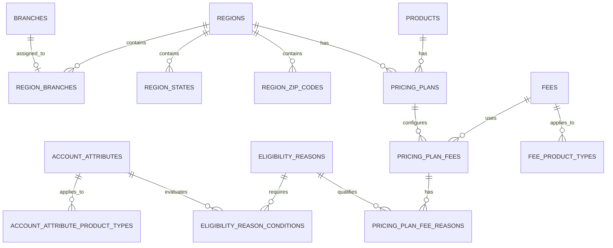

# Database Schema

This document describes the final database schema produced by the Flyway migrations in:

- `src/main/resources/db/migration` (portable migrations V1-V24)
- `src/main/resources/db/postgresql` (PostgreSQL-only V17)

The main application loads both locations. Standard tests load only `db/migration`; PostgreSQL migration tests explicitly load both. Consequently, the overlap exclusion constraint described below exists only when the PostgreSQL location is enabled.

## Schema overview

The schema has four main areas:

- branch, product, and region reference data;
- region assignment rules for branches, states, and ZIP codes;
- fee and account-attribute definitions with product-type applicability;
- effective-dated pricing plans, their fees, and eligibility reasons.

## Reference tables

### `branches`

| Column | Type | Null | Rules |
|---|---|---:|---|
| `id` | `bigint` identity | No | Primary key |
| `branch_code` | `varchar(25)` | No | Unique (`uk_branches_branch_code`) |
| `branch_name` | `varchar(100)` | No | |
| `state` | `varchar(2)` | No | |
| `zip_code` | `varchar(5)` | No | |
| `updated_on` | `timestamp with time zone` | No | |
| `updated_by` | `varchar(100)` | No | |

### `products`

| Column | Type | Null | Rules |
|---|---|---:|---|
| `id` | `bigint` identity | No | Primary key |
| `product_code` | `varchar(25)` | No | Unique (`uk_products_product_code`) |
| `product_name` | `varchar(100)` | No | |
| `product_type` | `varchar(20)` | No | `DEPOSIT`, `CD`, or `CREDIT` |
| `updated_on` | `timestamp with time zone` | No | |
| `updated_by` | `varchar(100)` | No | |

Constraint: `chk_products_product_type`.

### `regions`

| Column | Type | Null | Rules |
|---|---|---:|---|
| `id` | `bigint` identity | No | Primary key |
| `region_code` | `varchar(25)` | No | Unique (`uk_regions_region_code`) |
| `region_name` | `varchar(100)` | No | |
| `updated_on` | `timestamp with time zone` | No | |
| `updated_by` | `varchar(100)` | No | |

### `fees`

| Column | Type | Null | Rules |
|---|---|---:|---|
| `id` | `bigint` identity | No | Primary key |
| `fee_code` | `varchar(25)` | No | Unique (`uk_fees_fee_code`) |
| `fee_name` | `varchar(100)` | No | |
| `fee_type` | `varchar(20)` | No | `FLAT` or `PERCENT` |
| `updated_on` | `timestamp with time zone` | No | |
| `updated_by` | `varchar(100)` | No | |

Constraint: `chk_fees_fee_type`. Product applicability is stored in `fee_product_types`, not on this table.

### `account_attributes`

| Column | Type | Null | Rules |
|---|---|---:|---|
| `id` | `bigint` identity | No | Primary key |
| `attribute_code` | `varchar(25)` | No | Unique (`uk_account_attributes_attribute_code`) |
| `attribute_name` | `varchar(100)` | No | |
| `attribute_type` | `varchar(20)` | No | `TEXT`, `DECIMAL`, `INTEGER`, `DATE`, or `BOOLEAN` |
| `updated_on` | `timestamp with time zone` | No | |
| `updated_by` | `varchar(100)` | No | |

Constraint: `chk_account_attributes_attribute_type`.

### `eligibility_reasons`

| Column | Type | Null | Rules |
|---|---|---:|---|
| `id` | `bigint` identity | No | Primary key |
| `reason_code` | `varchar(25)` | No | Unique (`uk_eligibility_reasons_reason_code`) |
| `reason_name` | `varchar(100)` | No | |
| `updated_on` | `timestamp with time zone` | No | |
| `updated_by` | `varchar(100)` | No | |

## Region assignment tables

### `region_branches`

| Column | Type | Null | Rules |
|---|---|---:|---|
| `region_id` | `bigint` | No | Foreign key to `regions.id` |
| `branch_id` | `bigint` | No | Foreign key to `branches.id`; unique |

- Primary key: (`branch_id`, `region_id`).
- `uk_region_branches_new_branch_id` means a branch can belong to at most one region.
- The foreign keys have no explicit delete action.

The `_new` suffix remains in the constraint names because V3 created a replacement table and then renamed the table.

### `region_states`

| Column | Type | Null | Rules |
|---|---|---:|---|
| `region_id` | `bigint` | No | Foreign key to `regions.id` |
| `state_code` | `varchar(2)` | No | Unique |

- Primary key: (`state_code`, `region_id`).
- `uk_region_states_state_code` means a state code can belong to at most one region.
- The region foreign key has no explicit delete action.

### `region_zip_codes`

| Column | Type | Null | Rules |
|---|---|---:|---|
| `region_id` | `bigint` | No | Foreign key to `regions.id` |
| `zip_code` | `varchar(5)` | No | Unique |

- Primary key: (`zip_code`, `region_id`).
- `uk_region_zip_codes_zip_code` means a ZIP code can belong to at most one region.
- The region foreign key has no explicit delete action.

## Product-type membership tables

### `fee_product_types`

| Column | Type | Null | Rules |
|---|---|---:|---|
| `fee_id` | `bigint` | No | Foreign key to `fees.id`; `ON DELETE CASCADE` |
| `product_type` | `varchar(20)` | No | `DEPOSIT`, `CD`, or `CREDIT` |

- Primary key: (`fee_id`, `product_type`).
- Constraint: `chk_fee_product_types_product_type`.
- V20 backfilled all three product types for fees that had no membership rows at migration time.

### `account_attribute_product_types`

| Column | Type | Null | Rules |
|---|---|---:|---|
| `attribute_id` | `bigint` | No | Foreign key to `account_attributes.id`; `ON DELETE CASCADE` |
| `product_type` | `varchar(20)` | No | `DEPOSIT`, `CD`, or `CREDIT` |

- Primary key: (`attribute_id`, `product_type`).
- Constraint: `chk_account_attribute_product_types_product_type`.
- V22 backfilled all three product types for attributes that had no membership rows at migration time.

V24 removed the earlier `sort_order` columns from both membership tables. The database therefore preserves membership, but not display order. Neither table has a database constraint requiring at least one membership row.

## Eligibility conditions

### `eligibility_reason_conditions`

| Column | Type | Null | Rules |
|---|---|---:|---|
| `id` | `bigint` identity | No | Primary key |
| `reason_id` | `bigint` | No | Foreign key to `eligibility_reasons.id` |
| `attribute_id` | `bigint` | No | Foreign key to `account_attributes.id` |
| `operator` | `varchar(2)` | No | `=`, `>`, `<`, `>=`, `<=`, or `<>` |
| `attribute_value` | `text` | No | |

Constraint: `chk_eligibility_reason_conditions_operator`.

V23 replaced the original (`reason_id`, `attribute_id`, `operator`) primary key with the identity `id`. As a result, the schema permits multiple conditions with the same reason, attribute, and operator. Both foreign keys have no explicit delete action.

## Pricing configuration

### `pricing_plans`

| Column | Type | Null | Rules |
|---|---|---:|---|
| `id` | `bigint` identity | No | Primary key |
| `plan_code` | `varchar(25)` | No | Unique (`uk_pricing_plans_plan_code`) |
| `plan_name` | `varchar(100)` | No | |
| `product_id` | `bigint` | No | Foreign key to `products.id` |
| `region_id` | `bigint` | No | Foreign key to `regions.id` |
| `active_from` | `date` | No | Start of the active period |
| `active_through` | `date` | No | Inclusive end of the active period |
| `updated_on` | `timestamp with time zone` | No | |
| `updated_by` | `varchar(100)` | No | |

Portable constraint `chk_pricing_plans_active_period_order` requires `active_from <= active_through`.

When the PostgreSQL migration location is loaded, `excl_pricing_plans_active_period` prevents two plans for the same product and region from having overlapping inclusive date ranges. It uses the `btree_gist` extension and a GiST exclusion constraint over:

- `product_id` equality;
- `region_id` equality;
- overlap of `daterange(active_from, active_through, '[]')`.

The product and region foreign keys have no explicit delete action.

### `pricing_plan_fees`

| Column | Type | Null | Rules |
|---|---|---:|---|
| `pricing_plan_id` | `bigint` | No | Foreign key to `pricing_plans.id`; `ON DELETE CASCADE` |
| `fee_id` | `bigint` | No | Foreign key to `fees.id`; `ON DELETE RESTRICT` |
| `amount` | `numeric(19,4)` | No | Must be greater than or equal to zero |

- Primary key: (`pricing_plan_id`, `fee_id`).
- Constraint `chk_pricing_plan_fees_amount_nonnegative` permits zero and rejects negative amounts.
- Deleting a pricing plan removes its fee configurations. A fee referenced by a pricing plan cannot be deleted.

### `pricing_plan_fee_reasons`

| Column | Type | Null | Rules |
|---|---|---:|---|
| `pricing_plan_id` | `bigint` | No | Part of the foreign key to `pricing_plan_fees` |
| `fee_id` | `bigint` | No | Part of the foreign key to `pricing_plan_fees` |
| `reason_id` | `bigint` | No | Foreign key to `eligibility_reasons.id`; `ON DELETE RESTRICT` |

- Primary key: (`pricing_plan_id`, `fee_id`, `reason_id`).
- The composite foreign key to `pricing_plan_fees` uses `ON DELETE CASCADE`.
- Removing a plan fee removes its reason links. An eligibility reason used by a plan fee cannot be deleted.

## Constraint and index summary

Flyway defines the following database-enforced invariants:

- codes are unique within each reference table;
- every branch, state code, and ZIP code maps to at most one region;
- product types, account-attribute types, fee types, and condition operators use constrained value sets;
- pricing-plan active periods have valid date ordering;
- PostgreSQL pricing-plan periods cannot overlap for the same product and region;
- pricing-plan fee amounts are non-negative;
- product-type memberships cannot be duplicated for the same owner;
- a pricing plan cannot contain the same fee more than once;
- a plan fee cannot link the same eligibility reason more than once.

Primary keys, unique constraints, and the PostgreSQL exclusion constraint create their supporting indexes. The migrations do not define additional standalone indexes.

## Migration history affecting the final shape

| Migration | Final-schema effect |
|---|---|
| V1-V4 | Created the core reference/region tables, replaced code-based links with IDs, and changed pricing-plan periods to dates ending at `active_through`. |
| V5-V8 | Added account attributes, eligibility reasons and conditions, and fees; renamed product `account_type` to `product_type`. |
| V9-V10 | Moved fee applicability to a membership table and added the `CD` product type. |
| V11-V13 | Expanded business codes to 25 characters and established `fees.fee_type` as `FLAT` or `PERCENT`. |
| V14-V16 | Added plan fees and reason links, restricted deletion of referenced definitions, and initially required positive amounts. |
| PostgreSQL V17 | Added the inclusive active-period overlap exclusion constraint. |
| V18-V19 | Required ordered active dates and changed the amount rule from positive to non-negative. |
| V20-V22 | Backfilled empty product-type memberships and added account-attribute applicability. |
| V23 | Added identity keys to eligibility conditions, allowing duplicate reason/attribute/operator combinations. |
| V24 | Removed membership ordering and made owner/product-type pairs the primary keys. |

This document describes the resulting schema, not application-layer validation or JPA behavior. Where a foreign key has no `ON DELETE` clause, the migrations leave deletion behavior to the database default.
