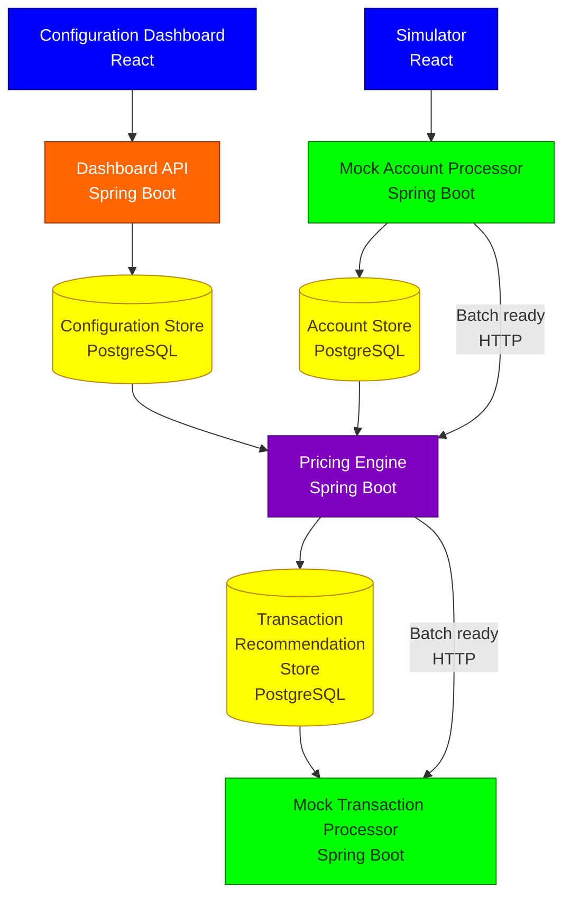
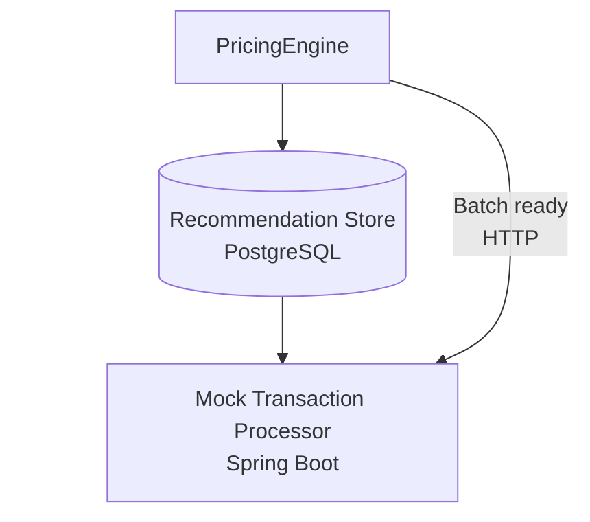

# Planned Architecture

Status: designed but unimplemented

## 1. Project purpose

This is a portfolio project intended to demonstrate engineering skills
beyond ordinary CRUD/full-stack feature development: system design,
domain modeling, distributed processing, failure handling, deployment,
observability, and architectural decision-making.

A substantial **Dashboard + Spring Boot backend + PostgreSQL
configuration database** already exists. It manages pricing
configuration such as Pricing Plans, Fees, Eligibility
Reasons/Conditions, Account Attributes, Products, Regions, etc.

The project has already consumed substantial development time, so future
work should favor **new architectural capabilities over additional
dashboard convenience features**.

## 2. High-level planned system

Conceptually:



The Pricing Engine reads pricing configuration from PostgreSQL while
processing persisted account batches.

The Account Processor and Transaction Processor are outside the pricing
system. Both are mocked by the simulator/test environment, but their
boundaries should behave as if they were independent external systems.

## 3. Dashboard / pricing configuration - IMPLEMENTED

The dashboard manages configuration used by the pricing engine:

-   Products
-   Pricing Plans
-   Fees
-   Eligibility Reasons
-   Conditions
-   Account Attributes
-   Regions/geographic applicability
-   Effective date ranges

PostgreSQL is appropriate here because the pricing configuration has
substantial relational structure.

### Pricing Plan lifecycle - IMPLEMENTED

Current design uses a **date-based lifecycle**:

**Scheduled → Active → Past**

The application's current/business date determines the stage.

Current proposed mutability:

-   **Scheduled:** fully mutable.
-   **Active:** only Plan Name and Active Through can change.
-   **Past:** only Plan Name can change.

The objective is **historical pricing integrity**: configuration changes
today must not silently alter what an effective/historical pricing plan
meant previously.

The backend already restricts updates to Fees, Eligibility Reasons and
Account Attributes when those changes would indirectly modify
active/past pricing plans.

This is **important domain correctness**, not mere UI polish.

## 4. Dashboard scope

Finish work necessary for historical integrity, lifecycle correctness,
important backend validation, preventing invalid configuration, and
correctness of relationships.

Avoid substantial additional time on convenience features, sophisticated
form behavior, prettier abstractions, unnecessary refactoring, or
elaborate frontend prevention of errors already safely rejected by the
backend.

The next major value comes from the **pricing engine and distributed
processing architecture**.

## 5. Simulator - FIRST ITERATION IMPLEMENTED

The simulator is a testing tool that tests the pricing system.
It will send a request to mock Account Processor and receive report
about transaction recommendations from mock Transaction Processor.

On the upstream side, the Mock Account Processor:

-   accepts or constructs account information/scenarios;
-   processes and stores the account batch;
-   notifies the Pricing Engine that the persisted account batch is ready
    for processing.

The Pricing Engine then processes the persisted account batch rather than
receiving the full batch as a transient notification payload.

On the downstream side, the Mock Transaction
Processor can consume persisted transaction recommendations after being
notified that a recommendation batch is ready.

Mock Account Processor and Mock Transaction processor will be located on Mock Server.
A Spring Boot server dedicated to house these two services.

In first iteration, the simulator sends an HTTP request directly to the pricing 
engine located in Pricing API back end server and receives an HTTP response with
transaction recommendations.

## 6. Pricing Engine

### Pricing Engine service and asynchronous processing

The Pricing Engine runs as its own Spring Boot server and processes batches
asynchronously.

The Account Processor persists an account batch in PostgreSQL, then sends an HTTP
notification to the Pricing Engine indicating that new account work may be available.
The HTTP notification is a wake-up signal; PostgreSQL is the durable source of pending
work, and the Pricing Engine queries it for unprocessed batches.

The Pricing Engine reads and processes pending account batches, applies pricing configuration,
and persists the resulting transaction recommendations in PostgreSQL. After recommendation
records are persisted, it sends an HTTP notification to the Transaction Processor indicating
that new recommendation work may be available. The Transaction Processor then queries the
recommendation store for unprocessed work.

On startup or restart, each consuming service checks PostgreSQL for unprocessed batches so
recovery does not depend on preserving notification messages while the service is down.

`batchId` remains the correlation identifier for persisted account batches and the resulting
transaction recommendations. The HTTP wake-up notification does **not** include `batchId`; its
only purpose is to tell the receiving service to check PostgreSQL for unprocessed work.

## 7. Recommendation vs transaction processing

The Pricing Engine should **not simply hand transaction recommendations
directly to the Transaction Processor as transient messages**.

Instead:



Reasons:

-   recommendations survive downstream outages;
-   calculation can be audited separately from posting;
-   posting failures do not require recalculating pricing;
-   failed batches can be inspected/retried;
-   pricing calculation and transaction posting remain separate
    responsibilities;
-   original calculated recommendations can be preserved.

A transaction recommendation is data, not a separate architectural
service.

## 8. Recommendation store: POSTGRESQL

Transaction recommendations will be stored in **PostgreSQL**.

The recommendation store is separate in purpose from the pricing configuration
data, even if both use PostgreSQL. Recommendation data is generated by the
Pricing Engine and is expected to be primarily append-oriented / immutable after
calculation.

Using PostgreSQL allows the recommendation batch, its recommendation records,
and the corresponding outbox row to be persisted atomically in one database
transaction.

The Transaction Processor can read recommendations from that PostgreSQL store.

The important point is an intentional recommendation data contract rather than
the Transaction Processor arbitrarily depending on unrelated internal Pricing
Engine persistence structures.

## 9. Batch-ready notifications

There are two notification boundaries:

1.  **Account Processor → Pricing Engine:** new account work may be available.
2.  **Pricing Engine → Transaction Processor:** new recommendation work may be available.

The notification is a **wake-up signal**, not the durable representation of work. The
business records are persisted in PostgreSQL before notification, and the consumer queries
the relevant PostgreSQL store for unprocessed batches.

Consumers also query PostgreSQL for unprocessed batches when they start or restart. Work
therefore remains discoverable even when a consumer was unavailable when the notification
was originally attempted.

## 10. Notification transport: HTTP

The producing service calls an endpoint on the downstream service after persisting new work.
The receiving service uses the request as a signal to check PostgreSQL for unprocessed batches;
it does not receive the batch records in the notification payload.

HTTP is intentionally used as a lightweight notification mechanism rather than as the durable
work queue. PostgreSQL holds the durable processing state and is the source from which pending
work is recovered.

### HTTP wake-up contract

The HTTP wake-up notification does **not** include `batchId`. It is a generic signal that new
work may be available. The receiving service responds by querying PostgreSQL for unprocessed
batches.

ADR 0005: **Use HTTP wake-up notifications with PostgreSQL-backed pending-work recovery**.

## 11. Transactional outbox

Persisted work-available notifications use an **outbox stored in the
producer-owned PostgreSQL database**.

The outbox is not an append-only event history. There is exactly **one outbox
row per batch**, and `batchId` is the primary key of that row. The row is
inserted once and its notification status is updated as publication progresses.
No additional outbox row is created for the same batch.

The producer's durable business result and the corresponding outbox row are
written atomically in the same local PostgreSQL transaction.

For Pricing Engine output, the transaction contains:

-   the recommendation batch and its recommendation records; and
-   the recommendation outbox row keyed by the same `batchId`.

This atomic transaction is local to the Recommendation Store. The architecture
does **not** require the Account Store and Recommendation Store to remain in the
same physical database.

## 12. Outbox publisher ownership and recovery

The same service that persists a batch/result owns the outbox row for that
batch and is responsible for publishing its wake-up notification.

Normal operation:

-   the service stores its durable batch/result and the one outbox row for that
    `batchId` atomically;
-   after persistence succeeds, the service publishes the HTTP wake-up
    notification;
-   the service updates the existing outbox row's notification status rather
    than inserting another row.

Recovery behavior:

-   when the service starts or restarts, it scans the outbox for rows whose
    status still requires publication;
-   as a producer it republishes any pending wake-up notifications it finds;
-   as a consumer it processes any ready batches;
-   continuous database polling solely for crash recovery is not part of the
    current design.

A producer may successfully send a wake-up notification and then crash before
updating the outbox status. On restart, the same notification can therefore be
sent again. This is expected and harmless because the notification contains no
business payload; it only tells the consumer to query PostgreSQL for pending
work.

## 13. Duplicate delivery / idempotency

Duplicate HTTP wake-up notifications are possible and must be tolerated.

Pricing-batch idempotency is based on the **one-outbox-row-per-batch invariant**:

-   `batchId` is the primary key of the outbox;
-   recommendation persistence and insertion of that outbox row happen in the
    same Recommendation Store transaction;
-   a second attempt to complete the same Pricing Batch cannot insert another
    outbox row with that `batchId`;
-   therefore a retry or concurrent Pricing Engine instance cannot commit a
    second set of recommendations for the same batch. The conflicting
    transaction is rejected/rolled back and the already-existing outbox row
    proves that the recommendation result for that `batchId` was previously
    committed.

This keeps the design scalable if the Account Store and Recommendation Store
are later separated into different databases.

In that future topology, updating the source Account Batch status and writing
the Recommendation Batch cannot be one local transaction. A failure can
therefore leave the Account Store temporarily showing a batch as ready even
though its recommendations were already committed.

If the Pricing Engine encounters that batch again, the existing outbox row with
the same `batchId` identifies it as already completed. The Pricing Engine must
not generate another committed recommendation result; it can instead repair the
source-batch status.

The same uniqueness rule also protects against two Pricing Engine instances
attempting to complete the same batch concurrently: only one transaction can
successfully insert the outbox row for that `batchId`.

The **Transaction Processor is outside the pricing-system boundary**. The
pricing system prices fees and produces transaction recommendations; it does
not post financial transactions to accounts. Transaction-posting idempotency is
therefore the responsibility of the external Transaction Processor, not this
system. The simulator uses a Mock Transaction Processor only to exercise that
external boundary and return/display recommendation results.

## 14. Documentation

Architecture documentation should have two levels.

### Main design documentation

Answers: **How does the system work?**

Include architecture diagram, component responsibilities, data flows,
storage ownership, sync/async communication, and major processing flows.

### ADRs

Answer: **Why did we choose X rather than reasonable alternative Y?**

Each ADR should be a separate small Markdown file:

``` text
docs/
  architecture/
    architecture.md
    adr/
      001-pricing-plan-lifecycle.md
      002-...
```

Typical ADR:

``` text
# Title

## Status
## Context
## Options Considered
## Decision
## Rationale
## Consequences
```

Good ADR candidates:

-   Pricing Plan lifecycle, mutability, and effects on referenced
    configuration
-   PostgreSQL recommendation persistence strategy
-   HTTP wake-up notifications with PostgreSQL-backed pending-work recovery
-   Transactional outbox and application-owned publishing/restart recovery
-   Pricing-batch idempotency and duplicate-safe recommendation persistence

Do not create ADRs merely to increase the count. Rough target: **5
strong ADRs**, perhaps 6--8 if genuinely important decisions emerge.

## 15. Immediate next steps

1.  Finish current dashboard lifecycle/integrity work.
2.  **Freeze dashboard scope.**
3.  Create lightweight overall system architecture.
4.  Finalize recommendation-store schema and ownership/data flow in PostgreSQL.
5.  Design Pricing Engine contract-first.
6.  Implement Pricing Engine.  <-- **we are here. Prototype engine implemented. Time to deploy slice**
7.  Implement batch/account processing.
8.  Implement persisted recommendations + downstream processing.
9.  Finalize the HTTP endpoint/request-response shape and design the remaining
    batch-processing idempotency details. The notification transport, absence of `batchId` in
    the wake-up signal, outbox reliability, publisher ownership, and startup recovery behavior
    are already decided.
10. Deploy.
11. Add structured logging, metrics, health checks and monitoring.
12. Finish architecture documentation/ADRs.

## Guiding principle

> **Do not add complexity merely to make the architecture look
> sophisticated. Every additional component---including Kafka, Lambda, CDC,
> or an outbox---needs a concrete responsibility and a
> defensible tradeoff.**

The next phase is intended to demonstrate **system-design judgment**,
not the ability to accumulate infrastructure services.
